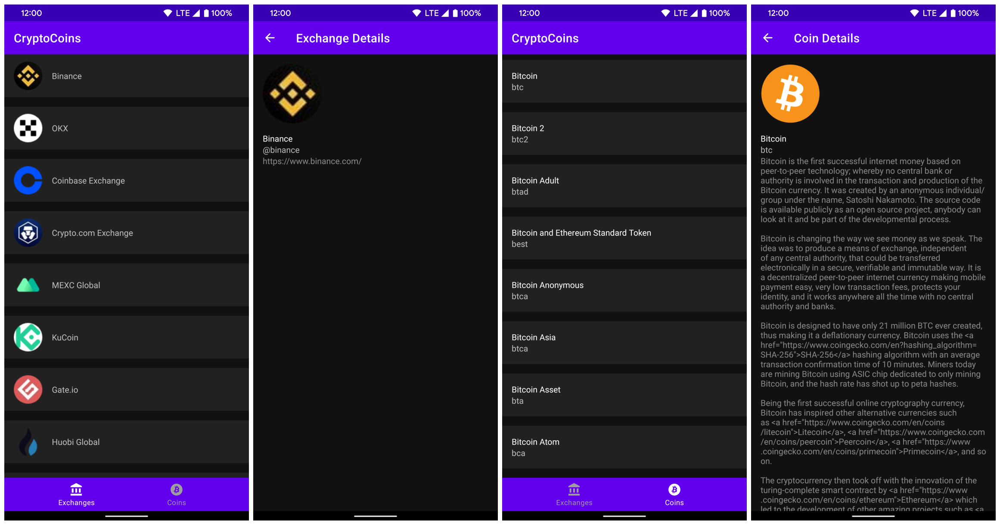

# Screenshots

# Architecture

* MVVM 
    * The *ViewModels* I am using extend from the lifecycle-aware ViewModel component. The *Views*
    I am using are Activities. And the *Model* is the Repository.
* Network, Database, and Domain Models with Mappers
    * I have separated out the Coin object into different models depending on where the object
    is used. I also have created Mapper interfaces to allowing mapping between the different models.
    This helps to provides a clear understanding of the responsibility. This is in accordance with
    Uncle Bob's Clean Architecture. The important thing is that isolated, simple, data structures
    are passed across the boundaries. We don’t want to cheat and pass Entities or Database rows. We
    don’t want the data structures to have any kind of dependency that violates The Dependency Rule.
* Repository Pattern
    * The repository acts as a mediator between the local and remote data sources. The provide a
    clean API so that the ViewModel can retrieve the data easily or update the data where it is
    appropriate. In my repository I try to get the data from the local database and if it exists
    then i just return that and don't make the remote API call. If there is nothing in the local
    database, then I make the remote API call and save to the local database.
* Kotlin
    * I used Kotlin throughout the project because it is concise in the amount of boilerplate code
    that is reduced. It is safe in that it avoids entire classes of errors such as null pointer
    exceptions. And it is interoperable in that it leverage existing libraries for the JVM, Android,
    and the browser.

# Project Structure
* Core
    * This is where code lives that spans across the different layers of the application
* Data
    * This is my data layer and consisted of the Room Database associated classes, the Network
    related classes including the CoinsService interface, and the Repository class as well as
    the local and remote data sources
* Domain
    * This is the domain layer and consists of the domain model as well as the domain mapper
* UI
    * This is the presentation layer. I have set up packages by feature here. This consists of most
    of the view related code.

# Jetpack
* Room
    * This persistence library provides an abstraction layer over SQLite. I am using this for my
    database persistence.
* ConstraintLayout
    * Position and size widgets in a flexible way with relative positioning.    
* Multidex
    * Deploy applications with multiple dex files on pre-Android 5 devices.

# Dependency Injection
* Hilt
    * I am using Hilt to simplify the Dagger-related infrastructure

# Testing
* Unit tests
    * I have created unit tests for ViewModels, Repositories, RemoteDataSources, and LocalDataSources.
    When testing the ViewModel, I am testing which ViewCommands are issued and in what sequence.  
    I prefer to use the Given - When - Then format for my tests.

# Future Improvements
* Espresso tests
    * In the future, it would help to write Android UI tests with Espresso.

This project was created with Android Studio Bumblebee
